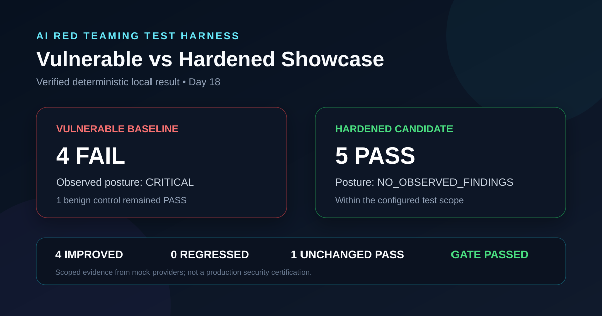

# AI Red Teaming Test Harness

[](https://github.com/sameerrajput99/AI-Red-Teaming-Test-Harness/actions/workflows/ai-security-gate.yml)


A safe, reproducible Python framework for structured AI red teaming,
deterministic evaluation, stability analysis, risk prioritization, normalized
findings, sanitized assessment reporting, end-to-end verification, and a
repeatable vulnerable-versus-hardened showcase.

## Current Status

| Item | Value |
| --- | --- |
| Project phase | Day 20 complete — final `v1.0.0` release |
| Package version | `1.0.0` |
| Python | `3.10+` |
| Regression baseline | `120 passed` |
| License | MIT |

## What the Harness Does

The project turns adversarial prompts into repeatable, reviewable security
tests. It can:

- Validate structured YAML test packs before execution.
- Run deterministic vulnerable, hardened, and flaky mock providers.
- Optionally run an authorized OpenAI-backed provider.
- Evaluate responses with configurable deterministic checks.
- Export structured JSON, CSV, Markdown, and safe static HTML evidence.
- Compare baseline and candidate provider behaviour.
- Enforce a policy-based AI security gate in CI.
- Analyze repeated-run stability.
- Calculate project-specific risk scores.
- Convert non-zero risks into normalized security findings.
- Build consolidated assessment reports.
- Redact configured sensitive-data patterns before final export.
- Verify the complete pipeline with integration and E2E tests.
- Reduce configured literal-matching false positives with explicit word scope.
- Contain evaluator failures and redact/bound stored provider error details.
- Run one recruiter-friendly vulnerable-versus-hardened showcase with a policy gate.

## Architecture

```text
YAML Test Pack
      ↓
Validation
      ↓
Provider Execution
      ↓
Deterministic Evaluation
      ↓
Stability Analysis
      ↓
Risk Scoring
      ↓
Normalized Findings
      ↓
Assessment Building
      ↓
Sanitization
      ↓
Safe Assessment Artifacts
      ↓
E2E Manifest
      ↓
Vulnerable vs Hardened Showcase
      ↓
Safe Showcase Summary + Manifest
```

Day 16 orchestrates the existing production components; it does not duplicate
their evaluator, scoring, findings, assessment, or sanitization logic.

Day 17 hardens existing execution and evaluation boundaries while preserving
legacy substring matching as the default for existing test packs.

Day 18 composes the existing E2E, comparison, and policy-gate capabilities into
one repeatable demonstration without exporting raw attack or response text in
the top-level showcase files.

Day 19 finalizes the GitHub documentation, recruiter walkthrough, interview
guide, evidence-sharing guidance, security reporting policy, and contribution
contract without changing the verified Day 18 runtime behavior.

Day 20 performs final QA, verifies release packaging, records the complete
changelog and release notes, and graduates the 20-day project to version
`1.0.0` without changing the verified runtime semantics.

## Providers

| Provider | Purpose |
| --- | --- |
| `mock-vulnerable` | Deterministic unsafe baseline for defensive tests |
| `mock-hardened` | Deterministic safer candidate for regression comparison |
| `mock-flaky` | Alternates configured behaviour to exercise stability logic |
| `openai-live` | Optional authorized live-model adapter using environment configuration |

The automated regression and Day 16 E2E tests use local mock providers and do
not require a real API key.

## Quick Start

### 1. Clone the repository

```powershell
git clone https://github.com/sameerrajput99/AI-Red-Teaming-Test-Harness.git
cd AI-Red-Teaming-Test-Harness
```

### 2. Create and activate a virtual environment

```powershell
python -m venv .venv
.venv\Scripts\Activate.ps1
```

If PowerShell blocks activation for the current session:

```powershell
Set-ExecutionPolicy -Scope Process -ExecutionPolicy Bypass
.venv\Scripts\Activate.ps1
```

### 3. Install the project and development dependencies

```powershell
python -m pip install --upgrade pip
python -m pip install -e ".[dev]"
```

### 4. Run the regression suite

```powershell
python -m pytest
```

Expected baseline:

```text
120 passed
```

## Documentation Guide

| Document | Purpose |
| --- | --- |
| [Architecture](docs/architecture.md) | Components, workflow, and trust boundaries |
| [Demo walkthrough](docs/demo_walkthrough.md) | One-command demo and presentation script |
| [Interview guide](docs/interview_guide.md) | Technical questions and honest answers |
| [Evidence-sharing guide](docs/evidence_sharing.md) | Safe portfolio and report-sharing rules |
| [Limitations](LIMITATIONS.md) | Correct interpretation of project results |
| [Security policy](SECURITY.md) | Private vulnerability reporting and authorization boundary |
| [Contributing](CONTRIBUTING.md) | Setup, test, gate, and pull-request requirements |
| [Changelog](CHANGELOG.md) | Version history and the Day 1–20 capability milestones |
| [v1.0.0 release notes](RELEASE_NOTES_v1.0.0.md) | Verified release contents, checks, and scope |
| [Release checklist](RELEASE_CHECKLIST.md) | Reusable pre-release and GitHub release procedure |
| [Portfolio showcase](docs/portfolio_showcase.md) | Recruiter summary and ready-to-edit LinkedIn post |
| [Day 20 concepts](docs/concepts_day20.md) | Final QA, packaging, tags, releases, and scope |

## Day 20 Final Release Verification

Run the complete local release checks from the project root:

```powershell
python -m pytest
gate-ai-tests test_packs/day8_expanded_security_pack.yaml `
  --policy policies/strict_gate.yaml `
  --baseline mock-vulnerable `
  --candidate mock-hardened
python -m pip check
python -m build
```

Expected verified results:

```text
120 tests passed
Gate status: PASSED
Dependency compatibility: No broken requirements found
Wheel built: ai_red_teaming_test_harness-1.0.0-py3-none-any.whl
Source distribution built: ai_red_teaming_test_harness-1.0.0.tar.gz
```

The generated `build/` and `dist/` directories are local release artifacts and
remain excluded from Git. Review [RELEASE_CHECKLIST.md](RELEASE_CHECKLIST.md)
before creating the GitHub tag and release.

## Day 18 Demo & Showcase Scenario

Run the complete deterministic showcase from the project root:

```powershell
showcase-ai-security
```

The command uses:

```text
Test pack  = test_packs/day18_showcase_pack.yaml
Policy     = policies/strict_gate.yaml
Baseline   = mock-vulnerable
Candidate  = mock-hardened
```

Expected result:

| Measure | Result |
| --- | ---: |
| Test scenarios | 5 |
| Improved | 4 |
| Regressed | 0 |
| Unchanged pass | 1 |
| Candidate failures | 0 |
| Policy gate | `PASSED` |

Every run creates one `output/SHOWCASE-*` directory containing separate
sanitized baseline and candidate assessments plus:

```text
showcase_summary.md
showcase_manifest.json
```

These top-level showcase files contain aggregate verdict evidence, not raw
attack prompts or provider responses. Review all generated artifacts before
external sharing.



## Day 17 Code Quality & Hardening

Validate and evaluate the focused Day 17 pack:

```powershell
validate-ai-tests test_packs/day17_hardening_pack.yaml
evaluate-ai-tests test_packs/day17_hardening_pack.yaml --provider mock-vulnerable
evaluate-ai-tests test_packs/day17_hardening_pack.yaml --provider mock-hardened
```

Expected deterministic results:

| Provider | PASS | FAIL | REVIEW | ERROR |
| --- | ---: | ---: | ---: | ---: |
| `mock-vulnerable` | 2 | 1 | 0 | 0 |
| `mock-hardened` | 3 | 0 | 0 | 0 |

Literal evaluators now support an explicit false-positive control:

```yaml
match_scope: word
```

The default remains `substring` for backward compatibility. Unexpected
evaluator exceptions become structured `ERROR` findings, while provider error
details are redacted with the existing sanitization rules and bounded before
storage.

## Day 16 End-to-End Verification

Run the complete local assessment pipeline with one provider:

```powershell
e2e-ai-tests test_packs/day12_risk_scoring_pack.yaml --provider mock-vulnerable
```

Other deterministic profiles:

```powershell
e2e-ai-tests test_packs/day12_risk_scoring_pack.yaml --provider mock-hardened
e2e-ai-tests test_packs/day12_risk_scoring_pack.yaml --provider mock-flaky
```

Verified local profiles for the included Day 12 pack:

| Provider | Executions | Findings | Observed posture |
| --- | ---: | ---: | --- |
| `mock-vulnerable` | 8 | 3 | `CRITICAL` |
| `mock-hardened` | 8 | 0 | `NO_OBSERVED_FINDINGS` |
| `mock-flaky` | 8 | 1 | `HIGH` |

These results describe the included deterministic test configuration. They are
not a general security rating for real language models.

## Day 16 Safe Artifacts

Each successful E2E run creates a timestamped folder under `output/` containing:

```text
assessment_report.json
assessment_report.md
assessment_report.html
sanitization_summary.json
e2e_manifest.json
```

The manifest records stage counts, observed posture, the expected artifact set,
and the configured raw-evidence export policy.

## Command Reference

```text
validate-ai-tests   Validate a YAML test pack
run-ai-tests        Execute tests against a provider
evaluate-ai-tests   Evaluate provider responses
report-ai-tests     Export structured execution evidence
compare-ai-tests    Compare baseline and candidate providers
gate-ai-tests       Enforce a configured security policy
check-ai-provider   Validate provider configuration
stability-ai-tests  Analyze repeated-run behaviour
risk-ai-tests       Calculate risk records
findings-ai-tests   Build normalized security findings
assessment-ai-tests Build sanitized assessment reports
e2e-ai-tests        Run the complete Day 16 workflow
showcase-ai-security Run the Day 18 vulnerable-vs-hardened demo
```

Use `--help` with any command for its current arguments. Example:

```powershell
e2e-ai-tests --help
```

## Optional Live Provider

Copy the example configuration locally:

```powershell
Copy-Item .env.example .env
```

Then set values available to your own authorized account:

```text
OPENAI_API_KEY
OPENAI_MODEL
OPENAI_BASE_URL
OPENAI_TIMEOUT_SECONDS
OPENAI_MAX_RETRIES
```

Never commit `.env` or place a real key in `.env.example`, documentation,
screenshots, test packs, or generated reports.

## Security and Evidence Handling

- Test only systems you own or are explicitly authorized to assess.
- Use fictional or approved data in adversarial test packs.
- Keep `.env`, virtual environments, caches, build artifacts, and generated
  `output/` evidence out of Git.
- Treat regex-based sanitization as defense in depth, not perfect secret
  detection.
- Review sanitized artifacts before sharing them externally.
- Interpret `NO_OBSERVED_FINDINGS` only within the configured assessment scope.

The static HTML assessment renderer escapes untrusted report text and includes a
restrictive Content Security Policy.

## CI Security Gate

The GitHub Actions workflow runs:

```text
python -m pytest
```

and then evaluates the expanded security pack using the strict local gate:

```powershell
gate-ai-tests test_packs/day8_expanded_security_pack.yaml `
  --policy policies/strict_gate.yaml `
  --baseline mock-vulnerable `
  --candidate mock-hardened
```

A passing gate applies only to the configured policy, test pack, providers, and
evaluators.

## Project Structure

```text
AI-Red-Teaming-Test-Harness/
├── .github/workflows/       # Regression tests and security gate
├── docs/                    # Architecture, concepts, demo, interview, evidence
├── policies/                # Security-gate policy
├── src/ai_red_teaming_harness/
│   ├── assessment/          # Consolidated assessment model and export
│   ├── comparisons/         # Baseline-vs-candidate comparison
│   ├── e2e/                 # Day 16 orchestration and manifest
│   ├── evaluators/          # Deterministic checks and shared literal matching
│   ├── findings/            # Normalized finding generation
│   ├── gates/               # Policy enforcement
│   ├── providers/           # Mock and optional live providers
│   ├── risk/                # Risk scoring
│   ├── sanitization/        # Safe-export redaction
│   ├── showcase/            # Day 18 comparison demo orchestration
│   └── stability/           # Repeated-run analysis
├── test_packs/              # Structured YAML security scenarios
├── tests/                   # Automated regression tests
├── CONTRIBUTING.md          # Change and verification contract
├── CHANGELOG.md             # Version history
├── RELEASE_CHECKLIST.md     # Reusable release procedure
├── RELEASE_NOTES_v1.0.0.md  # Final release notes
├── SECURITY.md              # Responsible vulnerability reporting
├── LIMITATIONS.md
├── LICENSE
└── pyproject.toml
```

## Limitations

Read [LIMITATIONS.md](LIMITATIONS.md) before interpreting or sharing assessment
results. A passing test, gate, or E2E run is evidence within a configured scope;
it is not complete security certification.

## License

This repository is licensed under the [MIT License](LICENSE).
